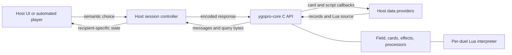

# Architecture and source navigation

Use this page to decide which repository and subsystem owns a behavior. Scope: [pinned local sources](source-versions.md). [Index](README.md) · [C API](core-api.md) · [EDOPro host](edopro-host.md).

## Responsibility boundary

| Responsibility | Owner | Evidence / implementation to read |
|---|---|---|
| Rule execution, effects, chains, timing, legal choice generation | Core plus compatible card scripts | [processor.cpp](../../native/ygopro-core/processor.cpp), [operations.cpp](../../native/ygopro-core/operations.cpp), [playerop.cpp](../../native/ygopro-core/playerop.cpp) |
| Raw card records and script bytes | Host callbacks | [OCG_DuelOptions](../../native/ygopro-core/ocgapi_types.h#L76), [duel::read_card](../../native/ygopro-core/duel.cpp#L148) |
| Deck files, restrictions, matchmaking, identity, clocks, transport | Host | [EDOPro host](edopro-host.md), [Duelcraft](duelcraft-jni.md) |
| Display text, images, animation, local perspective | Host client | [EDOPro data manager](../../../edopro/gframe/data_manager.cpp), [duelclient.cpp](../../../edopro/gframe/duelclient.cpp) |
| Copying and parsing output, preserving choice order, encoding replies | Adapter / host | [protocol](protocol.md), [responses](responses.md), [queries](queries.md) |
| Hidden-information filtering and spectator views | Authoritative host | [EDOPro host filtering](edopro-host.md); raw core queries have no recipient parameter |
| Replay storage and reconstruction | Host | [EDOPro replay mode](../../../edopro/gframe/replay_mode.cpp), [integration recipes](integration-recipes.md) |

The library can run without EDOPro, Minecraft, SQLite, a window system, or a network stack. Its callbacks receive already decoded card records and source bytes. EDOPro is a complete application around that boundary; Duelcraft supplies another adapter via JNI.

## Engine objects

| Object / file | Meaning | Read when |
|---|---|---|
| [`duel`](../../native/ygopro-core/duel.h#L45) | Per-duel aggregate: field, Lua interpreter, RNG, allocated cards/effects/groups, message/query buffers, card-data cache, callback context | Investigating ownership, caching, determinism, buffer lifetime |
| [`field`](../../native/ygopro-core/field.h#L397) | Two teams' zones plus processor queues, events, chains, turn state and rule options | Investigating rules, timing, location availability |
| [`player_info`](../../native/ygopro-core/field.h#L82) | LP/draw values and each team's zone lists; extra lists for additional duelists | Handling zones, team vs duelist, tag/relay state |
| [`card`](../../native/ygopro-core/card.h#L81) | One in-duel card instance, current/previous state, relationships and effects | Tracking a moving instance or calculating current stats |
| [`card_data`](../../native/ygopro-core/duel.h#L28) | Static rules data cached by card code | Loading a database; distinct from current modified card state |
| [`effect`](../../native/ygopro-core/effect.h#L24) | A registered rule/effect object with Lua references and conditions | Understanding script-created effects and activation |
| [`group`](../../native/ygopro-core/group.h#L19) | A collection of card objects exposed to Lua | Selection results, script group lifetimes |
| [`tevent`, `chain`](../../native/ygopro-core/field.h#L31) | Rule events and chain links with triggering context and targets | Activation/response timing and chain resolution |
| [`interpreter`](../../native/ygopro-core/interpreter.h) | Lua VM, object registration, script loading, calls and coroutines | Script errors, missing functions, yielding operations |

Card **code** identifies a database definition; it does not identify one physical copy. `controller/location/sequence` identifies a current address that can change after moves and shuffles. Retain host tracking state from messages rather than using code as a unique key. Read [card_state](../../native/ygopro-core/card.h#L33), [field::add_card](../../native/ygopro-core/field.cpp#L119), and [protocol location records](protocol.md).

## Processor execution

1. `OCG_StartDuel` enqueues `Processors::Startup`.
2. `OCG_DuelProcess` invokes `field::process` until output exists or the status is not continue.
3. `field::process` prepends subunits, visits the first queued typed processor, then removes a completed processor or increments its step. A processor marked `needs_answer` yields awaiting when its current step is incomplete.
4. Selection processors emit a prompt on one step and read `field::returns` on a later step. The host supplies bytes between those steps.
5. Rule operations may call Lua; script actions may enqueue more processors and yield a coroutine. Engine execution resumes those operations after required work or input completes.

Sources: [entry point](../../native/ygopro-core/ocgapi.cpp#L106), [queue visitor](../../native/ygopro-core/processor_visit.cpp#L9), [processor traits](../../native/ygopro-core/processor_unit.h#L15), [enqueue helpers](../../native/ygopro-core/field.h#L562), [Lua coroutine dispatch](../../native/ygopro-core/interpreter.cpp#L571).

`MSG_*` messages are host-facing protocol events. `EVENT_*` constants are rules-engine events used for effects. `PROCESSOR` / `Processors::*` names describe execution work. Do not treat these namespaces as interchangeable. The public API exports no arbitrary processor scheduling method.

## Source map by task

| Task / search terms | Start here | Follow into |
|---|---|---|
| Bind `OCG_*`, understand ABI | [ocgapi.h](../../native/ygopro-core/ocgapi.h), [ocgapi_types.h](../../native/ygopro-core/ocgapi_types.h) | [ocgapi.cpp](../../native/ygopro-core/ocgapi.cpp) |
| Decode a prompt, reject/accept its reply | [playerop.cpp](../../native/ygopro-core/playerop.cpp) named `Processors::Select*` | [responses](responses.md), EDOPro `DuelClient::ClientAnalyze` / `client_field.cpp` |
| Decode a move, draw, summon, damage message | [message index](message-index.md) | Producer's `new_message(MSG_...)` followed by typed `write<T>` calls |
| Query current stats, overlays or field structure | [card.cpp](../../native/ygopro-core/card.cpp) `card::get_infos` | [ocgapi.cpp](../../native/ygopro-core/ocgapi.cpp), [queries](queries.md) |
| Turn, phase, chain, adjustment timing | [processor.cpp](../../native/ygopro-core/processor.cpp) | `Turn`, `PointEvent`, `QuickEffect`, `AddChain`, `SolveChain`, `Adjust` |
| Draw, destroy, send, summon, move | [operations.cpp](../../native/ygopro-core/operations.cpp) | Corresponding `Processors::*`, helpers in [field.cpp](../../native/ygopro-core/field.cpp) |
| Script `Card.*`, `Effect.*`, `Group.*`, `Duel.*`, `Debug.*` | `libcard.cpp`, `libeffect.cpp`, `libgroup.cpp`, `libduel.cpp`, `libdebug.cpp` | Registration list at end of each file; [scriptlib.h](../../native/ygopro-core/scriptlib.h) for binding macros |
| Card's `initial_effect`, script name/alias behavior | [interpreter.cpp](../../native/ygopro-core/interpreter.cpp#L134) `register_card`, `load_card_script` | [data and scripts](data-and-scripts.md) |
| Core flags vs script-only flags | [ocgapi_constants.h](../../native/ygopro-core/ocgapi_constants.h), [common.h](../../native/ygopro-core/common.h), [effect_constants.h](../../native/ygopro-core/effect_constants.h) | [rules and coordinates](rules-and-coordinates.md) |
| Native crash around Lua failure | [interpreter.cpp](../../native/ygopro-core/interpreter.cpp#L31) | [build and compatibility](build-and-compatibility.md) |

For a Lua function, search the implementation macro, e.g. `LUA_STATIC_FUNCTION(SelectYesNo)` in [libduel.cpp](../../native/ygopro-core/libduel.cpp#L3098), rather than expecting a C++ method named `Duel::SelectYesNo`. Registration maps these functions into Lua tables. [scriptlib::check_action_permission](../../native/ygopro-core/scriptlib.cpp#L50) also explains why some operations are forbidden in non-action contexts.

The wiki maps the script API into its implementations; it does not duplicate every Lua method or card ruling. A host needs the data/script loading contract first. Card-specific semantics still belong to the actual script pack and engine revision.
