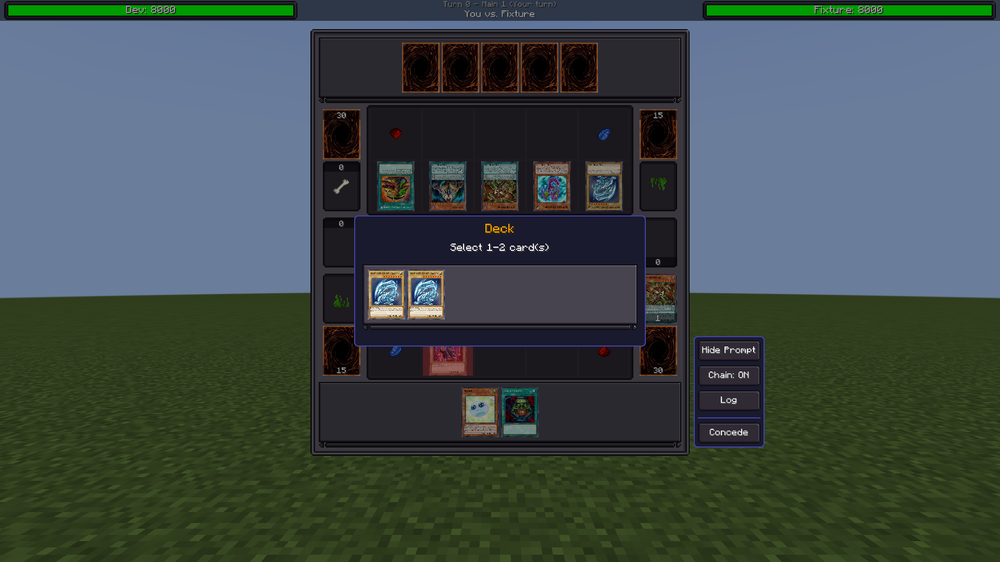
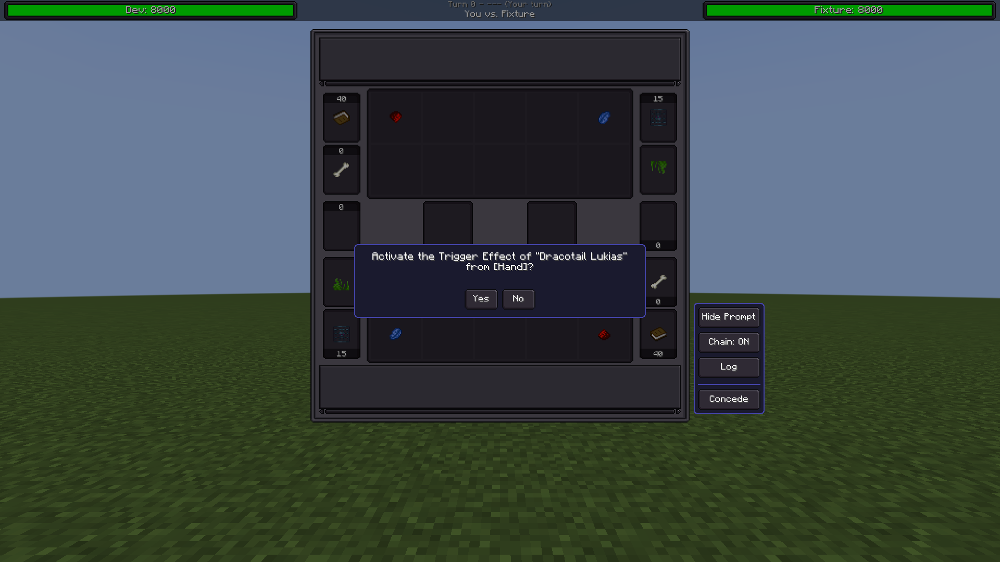
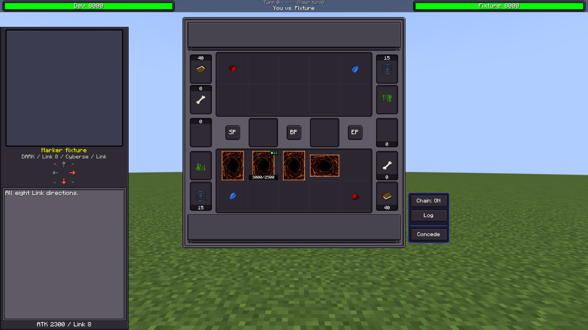
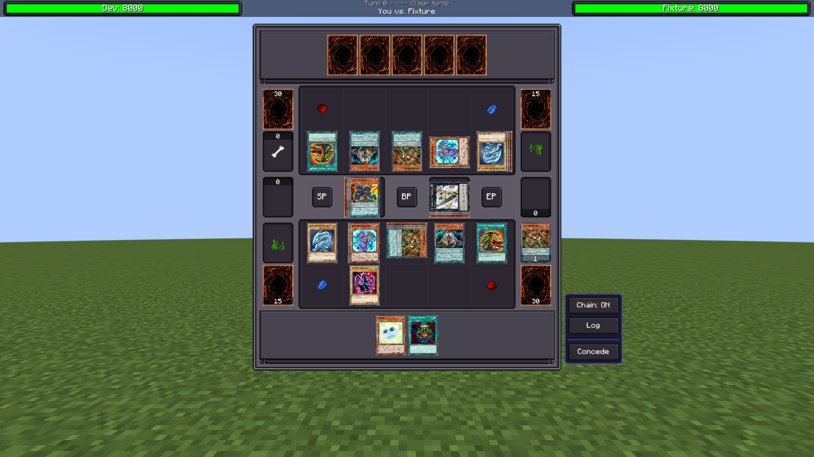
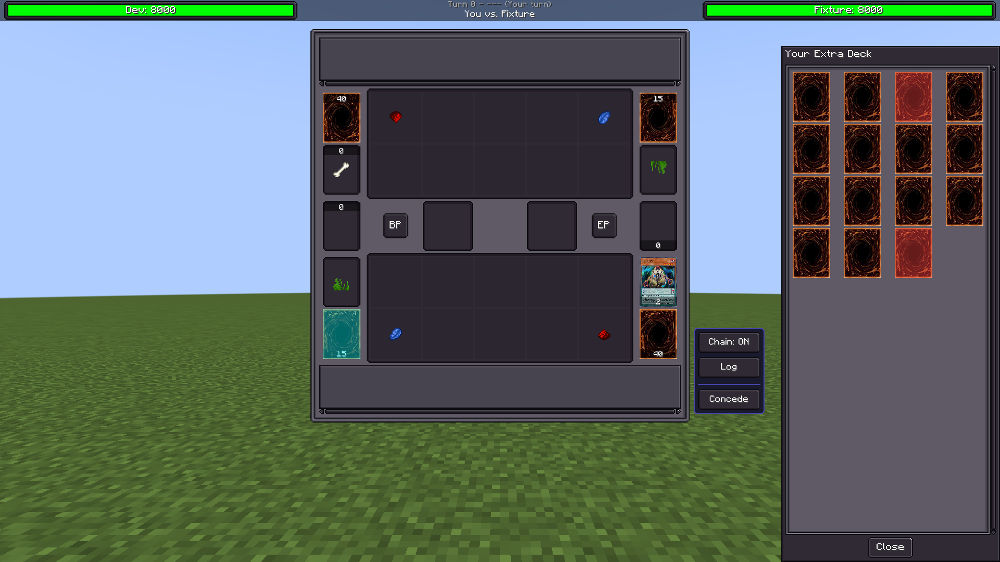
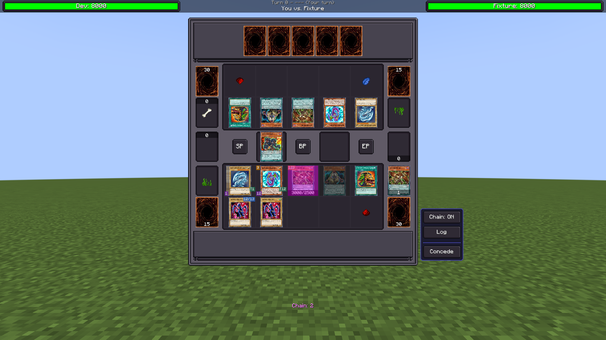
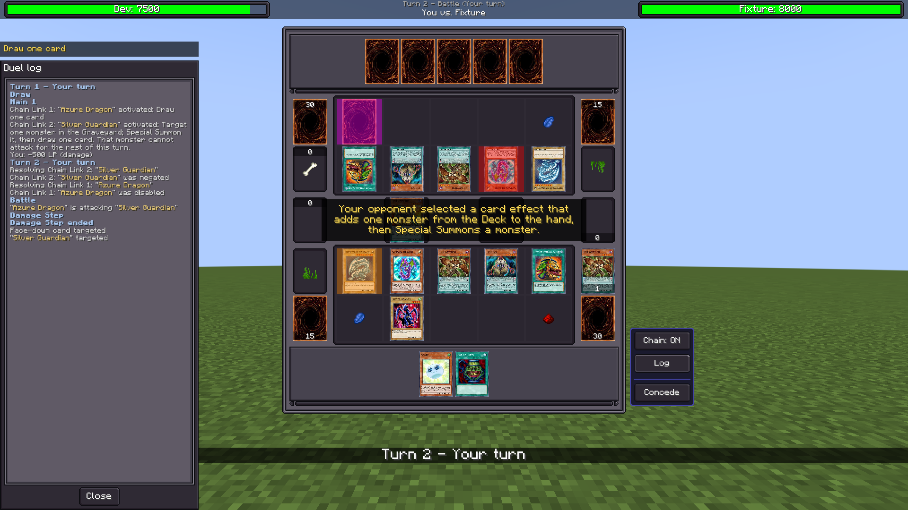
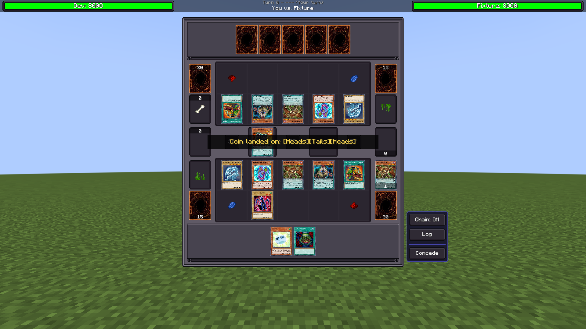
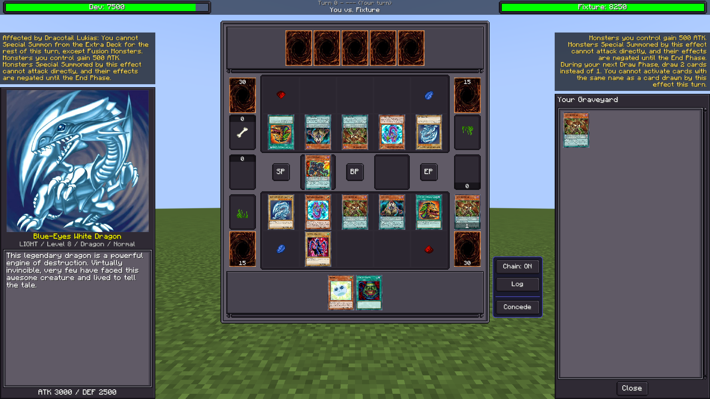

# Playtest polish review evidence

These are unmodified screenshots captured from the real Minecraft/LDLib2 screen on 2026-09-14. The scenarios use deterministic duel-message fixtures. Each selected image was checked against the full run's reviewed SHA-256 manifest before inclusion here.

## Validation

- Fresh 2026-09-17 `test --rerun assemble -x copyNative`: **617 tests passed**, no failures, errors or skips; assembly succeeded.
- Final full UI group at 1920×1080: **36/36 scenarios and 10,494/10,494 checks**. See the [archived report](ui-report-1920x1080.txt).
- Combined final readability runs at 1920×1080, 1280×720 and 1024×768: **50 scenario runs, 14,193 checks and 199 visually reviewed screenshots**. This directory contains nine representative captures; the complete local archives remain under `build/ui-review/`.
- Native source is unchanged. Local validation used Java 21, the existing Windows native DLLs and Project Ignis card/script data. The existing Ubuntu workflow still invokes the Windows-specific native build and is not fixed by this PR.

Repeat from a Windows checkout with the native/data prerequisites available:

```powershell
.\gradlew.bat test --rerun assemble -x copyNative --console=plain
.\gradlew.bat runClient -x copyNative '-PldTest=group:duelcraft' '-PldTestWindow=1920x1080' --console=plain
```

## Selection and effect questions

Selection sources are larger gold titles above detailed instructions. Effect questions substitute card names and locations instead of printing `%ls` tokens.




## Card details and field readability

Link markers form a red/gray 3×3 grid. Xyz materials render beneath their hosts, actionable inspector cards are highlighted, and annotation backgrounds contain multiple-digit text.






## Logs and feedback

The log distinguishes phase context, numbered chains and known card names. Sanitized targets use a generic face-down label. Toasts appear near the board center, while lingering effects wrap on translucent backgrounds above their owner's side panels.




